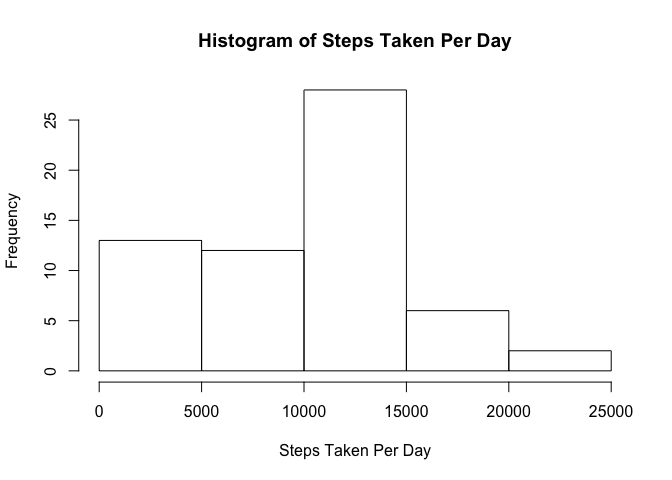
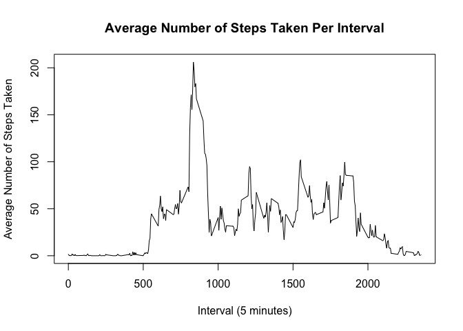
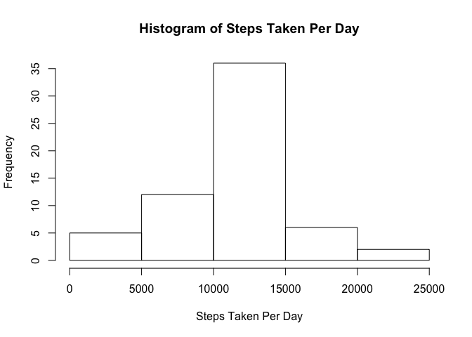

# Reproducible Research: Peer Assessment 1

## Loading and preprocessing the data

Unzip the file 


```r
filename <- c("activity.csv")

if (!file.exists(filename)) {
    unzip("activity.zip")    
}

# read file into memory
data <- read.csv(filename, na.strings = "NA")

# convert date variable to Date class
data$date <- as.Date(data$date)
```


## What is the mean total number of steps taken per day?


```r
# Calculate total number of steps taken per day
totalStepsPerDay <- tapply(data$steps, data$date, sum, na.rm = TRUE)

# Make histogram of total steps taken each day
hist(totalStepsPerDay, 
     main = "Histogram of Steps Taken Per Day", 
     xlab = "Steps Taken Per Day")
```

 

```r
# Mean of the sums
print(mean(totalStepsPerDay))
```

```
## [1] 9354.23
```

```r
# Median of the sums
print(median(totalStepsPerDay))
```

```
## [1] 10395
```


## What is the average daily activity pattern?


```r
# Calculate average steps taken per interval
avgStepsPerInterval <- tapply(data$steps, data$interval, mean, na.rm = TRUE)

# Convert to a data frame
df <- data.frame(avgStepsPerInterval)

# Make the row names their own column
df <- cbind(interval = rownames(df), df)

# Remove rownames
rownames(df) <- NULL

# Convert intervals to integers
df$interval <- as.integer(as.character(df$interval))

# Sort by increasing interval order
df <- df[order(df$interval), ]

# Time series plot of the 5-minute interval (x-axis) and the average number of steps taken, averaged across all days (y-axis)
title <- c("Average Number of Steps Taken Per Interval")
ylabel <- c("Average Number of Steps Taken")
xlabel <- c("Interval (5 minutes)")

plot(x = df$interval, y = df$avgStepsPerInterval, type = "l", main = title, ylab = ylabel, xlab = xlabel)
```

 

```r
# Find interval with maximum number of steps taken
sortedDescendingStepPerInterval <- df[order(df$avgStepsPerInterval, decreasing = TRUE), ]
print(sortedDescendingStepPerInterval[1,1])
```

```
## [1] 835
```


## Imputing missing values


```r
# Count total number of missing values
missing <- which(is.na(data$steps))
print(length(missing))
```

```
## [1] 2304
```

```r
# Create new dataset to include imputed missing values
dataWithImputedValues <- data

# Function to fill in missing values
fillin <- function() {
  
    # for each row of missing data, get and insert the average for the interval
    for (rowIndex in missing) {
  
        # get interval
        interval <- dataWithImputedValues[rowIndex, "interval"]
      
        # get interval average
        intervalAverage <- df[df$interval == interval, "avgStepsPerInterval"]
      
        # replace missing value with interval average
        dataWithImputedValues[rowIndex, "steps"] <<- intervalAverage
    }
}

# Actually fill in missing values
fillin()

# Check for missing values again - should be 0!
print(nrow(dataWithImputedValues[is.na(dataWithImputedValues$steps),]))
```

```
## [1] 0
```

```r
# Calculate total number of steps taken per day
totalStepsPerDay <- tapply(dataWithImputedValues$steps, 
                           dataWithImputedValues$date, 
                           sum, 
                           na.rm = TRUE)

# Make histogram of total steps taken each day
hist(totalStepsPerDay, 
     main = "Histogram of Steps Taken Per Day", 
     xlab = "Steps Taken Per Day")
```

 

```r
# Mean number of steps per day
print(mean(totalStepsPerDay))
```

```
## [1] 10766.19
```

```r
# Median number of steps per day
print(median(totalStepsPerDay))
```

```
## [1] 10766.19
```

The mean and median of the steps taken per day are greater when we impute missing values than when we excluded them in prior calculations. Imputing missing values increases the estimate of the total monthly number of steps.

## Are there differences in activity patterns between weekdays and weekends?


```r
# Create new factor variable for weekends and weekday

daysOfWeek <- c("Monday", "Tuesday", "Wednesday", "Thursday", "Friday", "Saturday", "Sunday")

dataWithImputedValues$weekdayStatus <- factor(weekdays(dataWithImputedValues$date), 
                              levels = daysOfWeek, 
                              labels = c(rep("weekday", 5), rep("weekend", 2))
                       )
```

```
## Warning in `levels<-`(`*tmp*`, value = if (nl == nL) as.character(labels)
## else paste0(labels, : duplicated levels in factors are deprecated
```
Make a panel plot containing a time series plot (i.e. type = "l") of the 5-minute interval (x-axis) and the average number of steps taken, averaged across all weekday days or weekend days (y-axis). See the README file in the GitHub repository to see an example of what this plot should look like using simulated data.


```r
library(data.table)
dt <- data.table(dataWithImputedValues)


aSPI <- dt[, mean(steps), by = interval, ]
head(aSPI)
```

```
##    interval        V1
## 1:        0 1.7169811
## 2:        5 0.3396226
## 3:       10 0.1320755
## 4:       15 0.1509434
## 5:       20 0.0754717
## 6:       25 2.0943396
```

```r
title <- c("Average Number of Steps Taken Per Interval")
ylabel <- c("Average Number of Steps Taken")
xlabel <- c("Interval (5 minutes)")


# For panel plots, let's use the lattice plotting system
library(lattice)
aDT <- dt[order(interval), ]
xyplot(steps ~ interval | weekdayStatus, 
       data = aDT, 
       layout = c(1,2), 
       type = "l", 
       xlab = xlabel,
       ylab = ylabel,
       main = paste(title, c("By Weekday Status"), sep = " "))
```

```
## Warning in `levels<-`(`*tmp*`, value = if (nl == nL) as.character(labels)
## else paste0(labels, : duplicated levels in factors are deprecated
```

 
